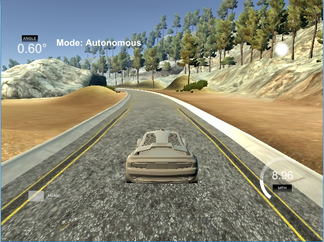

## Behaviorial Cloning Project

Overview
---
Project #3 from the Udacity Self-Driving Car program (SDC).
This code trains a Convolutional Neural Network (CNN) written in Keras for Tensor Flow. The network uses images taken from a virtual camera built in the car in the simulator. Once trained the network uses the information to autonomously drive the car inside the track in the simulator. Additional tunning parameters are also included to deal with undesired behaviors (ie. tendency to steer in a certain direction) 

Tools and Techniques
---

* Implemented in Tensor Flow(Python).
* Simplified CNN using Keras.

Reflections:
---
Simple CNN's built on keras can easily be deployed for testing purposes.

Pre-processing and tunning parameters techniques are nearly as important as the network itself for proper functioning. 
